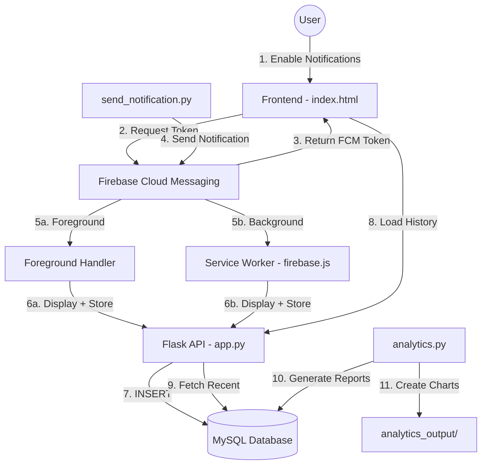

# 📸 Instagram Notification System

> A complete end-to-end real-time notification system using Firebase Cloud Messaging (FCM), Python, Flask, and MySQL with advanced analytics capabilities.

[](https://www.python.org/)
[](https://flask.palletsprojects.com/)
[](https://firebase.google.com/)
[](https://www.mysql.com/)

---

## ✨ Features

- 🔔 **Real-time Push Notifications** - Foreground and background notification support
- 💾 **Database Persistence** - All notifications stored in MySQL with auto-increment IDs
- 📊 **Advanced Analytics** - 7 visualizations and 4 CSV reports
- 🎨 **Modern UI** - Beautiful, responsive web interface
- 🚀 **Bulk Sending** - Send multiple notifications with customizable delays
- 🎯 **Interactive Mode** - Menu-driven notification sending
- 📈 **Real-time Statistics** - Session and total notification counters
- 🔄 **Persistent History** - Notifications reload from database on page refresh

---

## 🔄 System Architecture



---

## 🛠️ Components

### **Frontend**
- **`index.html`** - Modern web interface with real-time statistics
  - FCM token display and copy functionality
  - Session and total notification counters
  - Recent notifications list with timestamps
  - Toast notifications for user feedback
  - XSS protection with HTML escaping

### **Backend**
- **`app.py`** - Flask server with 3 API endpoints
  - `GET /` - Serve frontend
  - `POST /store-notification` - Save notifications to database
  - `GET /notification-count` - Get total notification count
  - `GET /recent-notifications` - Fetch last 10 notifications

### **Service Worker**
- **`firebase.js`** - Background notification handler
  - Receives notifications when browser is inactive
  - Displays system notifications
  - Stores notifications in database

### **Notification Sender**
- **`send_notification.py`** - Advanced notification sending utility
  - 40+ realistic Instagram-like templates
  - 8 categories: likes, comments, follows, messages, tags, live, posts, activity
  - Multiple modes: default, bulk, custom, interactive
  - Command-line arguments for flexibility

### **Analytics**
- **`analytics.py`** - Comprehensive analytics engine
  - 7 visualizations (PNG charts)
  - 4 CSV reports for further analysis
  - SQLAlchemy integration (no warnings!)
  - Professional, emoji-enhanced output

### **Database**
- **`instagram.sql`** - MySQL schema
  - Auto-increment primary key
  - Timestamp tracking
  - Type distinction (foreground/background)
  - Unique constraint to prevent duplicates

---

## 🚀 Setup & Installation

### **1. Prerequisites**
- Python 3.11 or higher
- MySQL 8.0 or higher
- Modern web browser (Chrome, Firefox, Edge)
- Firebase project with FCM enabled

### **2. Database Setup**

```bash
# Login to MySQL
mysql -u root -p

# Run the SQL schema
mysql -u root -p < instagram/instagram.sql
```

Or manually:
```sql
CREATE DATABASE instagram;
USE instagram;

CREATE TABLE notifications (
    id INT AUTO_INCREMENT PRIMARY KEY,
    title VARCHAR(255) NOT NULL,
    body TEXT NOT NULL,
    type ENUM('foreground', 'background') NOT NULL,
    source VARCHAR(50) DEFAULT 'Instagram',
    received_at TIMESTAMP DEFAULT CURRENT_TIMESTAMP,
    UNIQUE KEY unique_notification (title, body(255), type, source)
);
```

### **3. Python Dependencies**

```bash
pip install flask flask-cors mysql-connector-python firebase-admin pandas matplotlib seaborn sqlalchemy
```

### **4. Firebase Configuration**

1. Create a Firebase project at [Firebase Console](https://console.firebase.google.com/)
2. Enable Cloud Messaging
3. Download Service Account Key → Save as `instagram/firebase_service.json`
4. Get your Firebase config (Web API Key, Project ID, etc.)
5. Update `index.html` and `firebase.js` with your config

### **5. Database Configuration**

Update the database password in these files:
- `instagram/app.py` (line 16)
- `instagram/analytics.py` (line 29)

```python
DB_CONFIG = {
    'host': 'localhost',
    'user': 'root',
    'password': 'YOUR_PASSWORD',  # Change this
    'database': 'instagram'
}
```

---

## 🏃‍♂️ How to Run

### **Step 1: Start the Server**

```bash
cd instagram-data-analysis-main
python instagram/app.py
```

Server runs on `http://localhost:8000`

### **Step 2: Enable Notifications**

1. Open `http://localhost:8000/` in your browser
2. Click **"🔔 Enable Notifications"**
3. Allow notification permission when prompted
4. Copy the **FCM Token** displayed on the page

### **Step 3: Update FCM Token**

Paste your token in `instagram/send_notification.py` (line 210):

```python
parser.add_argument('--token', type=str, 
                   default="YOUR_FCM_TOKEN_HERE",
                   help='FCM device token')
```

### **Step 4: Send Notifications**

#### **Send One Random Notification:**
```bash
python instagram/send_notification.py
```

#### **Send 10 Notifications (Bulk Mode):**
```bash
python instagram/send_notification.py --bulk 10 --delay 2
```

#### **Send Custom Notification:**
```bash
python instagram/send_notification.py --custom "Hello from Instagram! 🎉" --title "Custom Alert"
```

#### **Interactive Mode:**
```bash
python instagram/send_notification.py --interactive
```

### **Step 5: Generate Analytics**

```bash
python instagram/analytics.py
```

View outputs in `analytics_output/` directory:
- 7 PNG visualizations
- 4 CSV reports

---

## 📊 Analytics Features

### **Visualizations Generated:**

1. **`notification_types.png`** - Pie chart of foreground vs background
2. **`hourly_distribution.png`** - Bar chart by hour of day
3. **`top_actions.png`** - Top 10 notification messages
4. **`daily_trend.png`** - Line chart of last 30 days
5. **`day_of_week.png`** - Bar chart by day of week
6. **`time_period_heatmap.png`** - Heatmap of day vs time period
7. **`notification_timeline.png`** - Scatter plot timeline

### **CSV Reports Generated:**

1. **`all_notifications.csv`** - Complete notification data
2. **`hourly_summary.csv`** - Aggregated by hour
3. **`daily_summary.csv`** - Aggregated by day
4. **`weekly_summary.csv`** - Aggregated by week

---

## 🎯 API Endpoints

### **1. Store Notification**
```http
POST /store-notification
Content-Type: application/json

{
  "title": "Instagram Notification",
  "body": "john_doe liked your photo",
  "type": "foreground",
  "source": "Instagram"
}

Response: {"message": "Notification stored successfully"}
```

### **2. Get Notification Count**
```http
GET /notification-count

Response: {"total": 42}
```

### **3. Get Recent Notifications**
```http
GET /recent-notifications

Response: {
  "notifications": [
    {
      "id": 42,
      "title": "Instagram Notification",
      "body": "sarah_smith commented on your post",
      "type": "foreground",
      "source": "Instagram",
      "received_at": "2026-01-11 13:00:00"
    },
    ...
  ]
}
```

---

## 📱 Notification Templates

The system includes 40+ realistic Instagram-like notification templates across 8 categories:

### **Categories:**
- ❤️ **Likes** - "john_doe liked your photo", "Your post has 42 new likes"
- 💬 **Comments** - "sarah_smith commented on your post"
- 👥 **Follows** - "mike_jones started following you"
- 📩 **Messages** - "lisa_brown sent you a message"
- 🏷️ **Tags** - "alex_wilson tagged you in a photo"
- 🔴 **Live** - "emma_davis is live now!"
- 📸 **Posts** - "chris_taylor shared a new post"
- 🔔 **Activity** - "You have 15 new notifications"

---

## 🧪 Testing

### **Test Foreground Notifications:**
1. Keep browser tab **ACTIVE**
2. Run: `python instagram/send_notification.py`
3. **Expected**: Notification appears immediately, counters increment

### **Test Background Notifications:**
1. **MINIMIZE** browser or switch to another tab
2. Run: `python instagram/send_notification.py`
3. **Expected**: System notification appears, saved to database

### **Test Database Persistence:**
1. Send notifications: `python instagram/send_notification.py --bulk 5`
2. **Close browser completely**
3. Reopen to `http://localhost:8000/`
4. **Expected**: All 5 notifications visible in list

### **Verify Database:**
```bash
python instagram/check_db.py
```

Or in MySQL:
```sql
USE instagram;
SELECT * FROM notifications ORDER BY received_at DESC LIMIT 10;
```

---

## 📂 Project Structure

```
instagram-data-analysis-main/
├── instagram/
│   ├── index.html              # Frontend web interface
│   ├── firebase.js             # Service Worker
│   ├── app.py                  # Flask backend
│   ├── send_notification.py    # Notification sender
│   ├── analytics.py            # Analytics engine
│   ├── check_db.py             # Database verification
│   ├── instagram.sql           # Database schema
│   ├── inta analyst.sql        # SQL analytics queries
│   ├── firebase_service.json   # Firebase credentials (not in repo)
│   ├── README.md               # This file
│   ├── HOW_IT_WORKS.md         # Detailed system documentation
│   ├── SYSTEM_STATUS.md        # Current system status
│   └── ANALYTICS_IMPROVEMENTS.md # Analytics improvements log
└── analytics_output/           # Generated analytics (auto-created)
    ├── *.png                   # Visualizations
    └── *.csv                   # CSV reports
```

---

## 🔧 Configuration

### **Database Configuration:**
Update in `app.py` and `analytics.py`:
```python
DB_CONFIG = {
    'host': 'localhost',
    'user': 'root',
    'password': 'xyz',  # Change this
    'database': 'instagram'
}
```

### **Firebase Configuration:**
Update in `index.html` and `firebase.js`:
```javascript
const firebaseConfig = {
    apiKey: "YOUR_API_KEY",
    authDomain: "YOUR_PROJECT.firebaseapp.com",
    projectId: "YOUR_PROJECT_ID",
    // ... other config
};
```

### **FCM Token:**
Update in `send_notification.py`:
```python
default="YOUR_FCM_TOKEN_HERE"
```

---

## 🐛 Troubleshooting

### **No Notifications Appearing**
- ✅ Check Flask server is running on port 8000
- ✅ Verify FCM token matches browser token
- ✅ Check browser console for errors (F12)
- ✅ Ensure notification permission is granted

### **Database Connection Error**
- ✅ Verify MySQL is running
- ✅ Check database credentials in `app.py`
- ✅ Ensure `instagram` database exists

### **Service Worker Not Registering**
- ✅ Use HTTPS or localhost (required for Service Workers)
- ✅ Check `firebase.js` is accessible at `/firebase.js`
- ✅ Clear browser cache and reload

### **Analytics Warnings**
- ✅ Install SQLAlchemy: `pip install sqlalchemy`
- ✅ Ensure database has data
- ✅ Check database credentials in `analytics.py`

---

## 📈 Performance

- **Database**: Auto-increment IDs, indexed timestamps
- **API**: Efficient queries with proper connection handling
- **Frontend**: Lazy loading, XSS protection
- **Analytics**: SQLAlchemy engine with proper disposal

---

## 🔒 Security

- ✅ **XSS Protection** - HTML escaping in frontend
- ✅ **CORS Enabled** - Configured for localhost
- ✅ **Unique Constraints** - Prevents duplicate notifications
- ✅ **Environment Variables** - Recommended for production (use `.env` file)

---

## 📚 Documentation

- **`README.md`** - This file (setup and usage)
- **`HOW_IT_WORKS.md`** - Detailed system architecture and flow
- **`SYSTEM_STATUS.md`** - Current system status and testing guide
- **`ANALYTICS_IMPROVEMENTS.md`** - Analytics enhancement log

---

## 🎯 Use Cases

- 📱 Real-time notification systems
- 📊 User engagement analytics
- 🔔 Push notification testing
- 📈 Data visualization projects
- 🎓 Learning Firebase Cloud Messaging
- 💼 Portfolio projects

---

## 🚀 Future Enhancements

- [ ] User authentication
- [ ] Multiple user support
- [ ] Notification preferences
- [ ] Email notifications
- [ ] Mobile app integration
- [ ] Real-time dashboard
- [ ] Notification scheduling

---

## 📝 License

This project is for educational purposes.

---

## 👨‍💻 Author

Created with ❤️ for learning Firebase Cloud Messaging and real-time notification systems.

---

## 🙏 Acknowledgments

- Firebase Cloud Messaging
- Flask Framework
- MySQL Database
- Matplotlib & Seaborn for visualizations

---

## 📞 Support

For issues or questions:
1. Check the troubleshooting section
2. Review `HOW_IT_WORKS.md` for detailed explanations
3. Verify all configuration files are updated

---

**Last Updated**: January 11, 2026  
**Version**: 2.0 (with persistent notification history and advanced analytics)

---

## ✨ Quick Start Summary

```bash
# 1. Setup database
mysql -u root -p < instagram/instagram.sql

# 2. Install dependencies
pip install flask flask-cors mysql-connector-python firebase-admin pandas matplotlib seaborn sqlalchemy

# 3. Configure
# - Update database password in app.py and analytics.py
# - Add firebase_service.json
# - Update Firebase config in index.html and firebase.js

# 4. Run server
python instagram/app.py

# 5. Open browser
# http://localhost:8000

# 6. Send notifications
python instagram/send_notification.py --bulk 10

# 7. Generate analytics
python instagram/analytics.py
```

**🎉 Enjoy your Instagram Notification System!**
